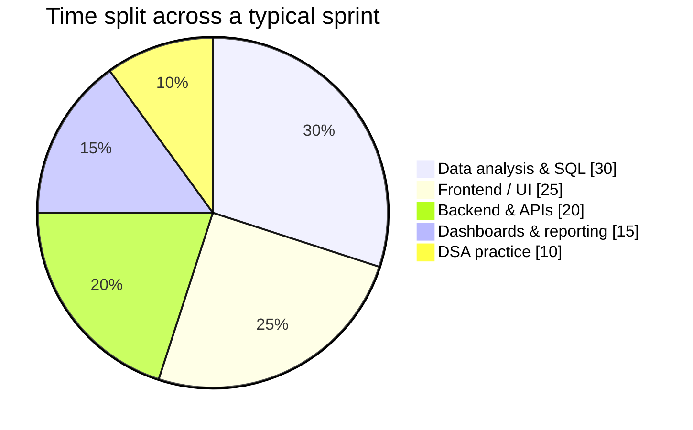
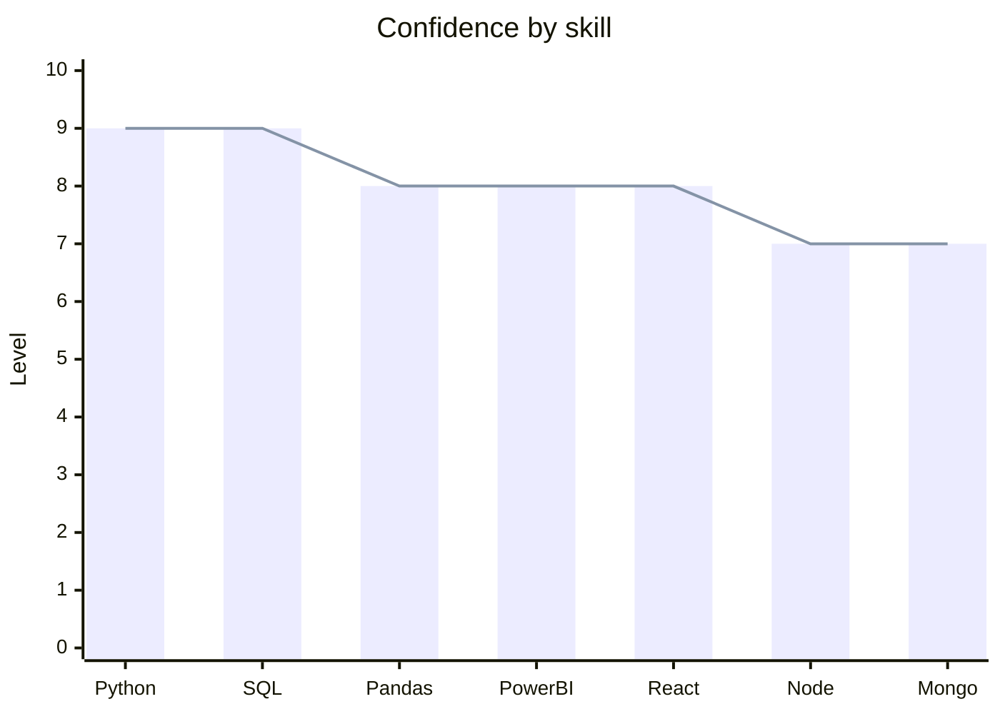
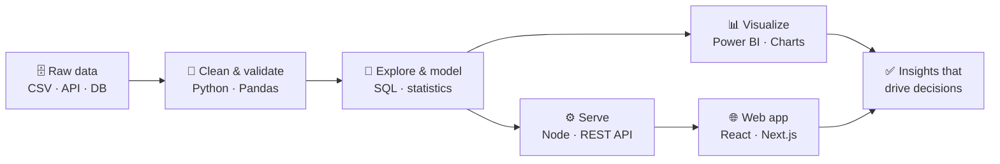
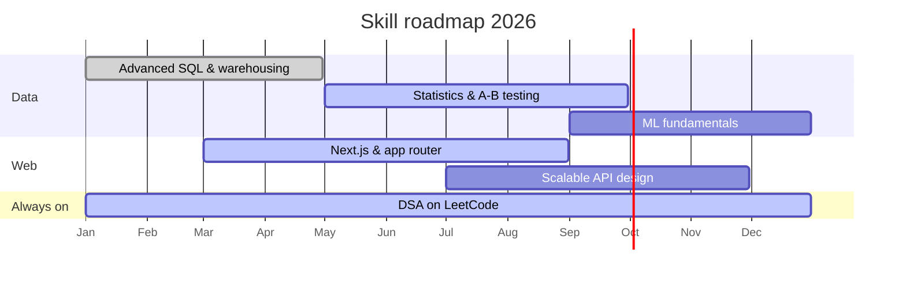

<div align="center">

</div>

<h3 align="center">Turning Data into Insights &nbsp;•&nbsp; Building Web Experiences</h3>

<p align="center">
<a href="https://github.com/Anki1004">

</a>
</p>

<p align="center">
<a href="https://www.ankitdataanalyst.me/"></a>
<a href="mailto:ankit25679@gmail.com"></a>
<a href="https://leetcode.com/u/It6DhpMCpq/"></a>
</p>

<p align="center">

<a href="https://github.com/Anki1004?tab=followers"></a>
<a href="https://github.com/Anki1004?tab=repositories"></a>
</p>

---

## 👨‍💻 About Me

```ts
const ankit = {
  role: ["Data Analyst", "Full Stack Developer"],
  stack: {
    data: ["Python", "SQL", "Pandas", "Power BI", "Excel"],
    web:  ["React", "Next.js", "Node.js", "Express", "MongoDB"],
  },
  focus: ["Data storytelling", "Scalable APIs", "Clean UI"],
  currently: "Building products that ship, and solving DSA daily",
  motto: "Measure, build, iterate.",
};
```

<table>
<tr>
<td valign="top" width="50%">

**What I do**

- 📊 Turn raw, messy data into dashboards and decisions.
- 🌐 Build responsive, end-to-end web apps (frontend → backend).
- 🔎 Explore, clean and model data with Python + SQL.
- 🧩 Sharpen problem solving with DSA on LeetCode.

</td>
<td valign="top" width="50%">

**Quick facts**

- 🌱 Learning: data visualization, modern web frameworks, scalable APIs.
- 🤝 Open to: freelance, internships and open-source collaboration.
- 💬 Ask me about: data analysis, Python, SQL, full-stack development.
- 📫 Reach me: **ankit25679@gmail.com**

</td>
</tr>
</table>

---

## 🧰 Tech Stack

<table align="center">
<tr>
<td align="center" width="180"><b>📊 Data & Analytics</b></td>
<td>

<br />


</td>
</tr>
<tr>
<td align="center"><b>🌐 Frontend</b></td>
<td>

<br />


</td>
</tr>
<tr>
<td align="center"><b>⚙️ Backend & Data Stores</b></td>
<td>

<br />


</td>
</tr>
<tr>
<td align="center"><b>🛠️ Tools & Deploy</b></td>
<td>

</td>
</tr>
</table>

---

## 🚀 Featured Projects

<table>
<tr>
<td width="33%" valign="top">
<h3 align="center">🧮 AllSmartCalculators</h3>
<p align="center">A suite of free online calculators for finance, health, math &amp; education — EMI, SIP, BMI, GPA and more. Browser-based, no signup, accurate answers in seconds.</p>
<p align="center"> </p>
<p align="center">
<a href="https://allsmartcalculators.com/"></a>
</p>
</td>
<td width="33%" valign="top">
<h3 align="center">📄 ResumeBanao</h3>
<p align="center">AI-powered resume tailoring for job seekers. Paste a job description to get an ATS-optimized resume &amp; cover letter, with an ATS checker and score insights.</p>
<p align="center"> </p>
<p align="center">
<a href="https://resumebanao.app/"></a>
</p>
</td>
<td width="33%" valign="top">
<h3 align="center">🎮 360PlayZone</h3>
<p align="center">A free online gaming portal with 500+ browser games across Action, Puzzle, Racing, Arcade &amp; more — including classics like Pac-Man, 2048 and Space Invaders.</p>
<p align="center"> </p>
<p align="center">
<a href="https://360playzone.com/"></a>
</p>
</td>
</tr>
</table>

---

## 📈 Data Visualization Corner

<sub>Rendered natively by GitHub with Mermaid — no external image service, so these always load instantly.</sub>

**🥧 Where my build time goes**



**📊 Skill confidence, self-rated out of 10**



**🔄 How I take a project from raw data to a live dashboard**



**🗺️ 2026 learning roadmap**



**⚡ Toolbox usage at a glance**

| Tool | Usage | Share |
| :--- | :--- | ---: |
| Python | ██████████████████░░ | 90% |
| SQL | █████████████████░░░ | 85% |
| JavaScript / TypeScript | ████████████████░░░░ | 80% |
| React / Next.js | ███████████████░░░░░ | 75% |
| Power BI / Excel | ██████████████░░░░░░ | 70% |
| Node.js / Express | █████████████░░░░░░░ | 65% |

---
## 📊 GitHub Analytics

<p align="center">

</p>

<p align="center">


</p>

<p align="center">


</p>

---
## 🧩 LeetCode & Problem Solving

<p align="center">

</p>

---

## 🤝 Connect With Me

<p align="center">
<a href="https://www.ankitdataanalyst.me/"></a>
<a href="mailto:ankit25679@gmail.com"></a>
<a href="https://leetcode.com/u/It6DhpMCpq/"></a>
<a href="https://github.com/Anki1004"></a>
</p>

<div align="center">

💡 *"Data tells the story — good software makes people listen."*

</div>

---

<p align="center">⭐️ From <a href="https://github.com/Anki1004">Anki1004</a> — turning data into insights, one commit at a time.</p>


